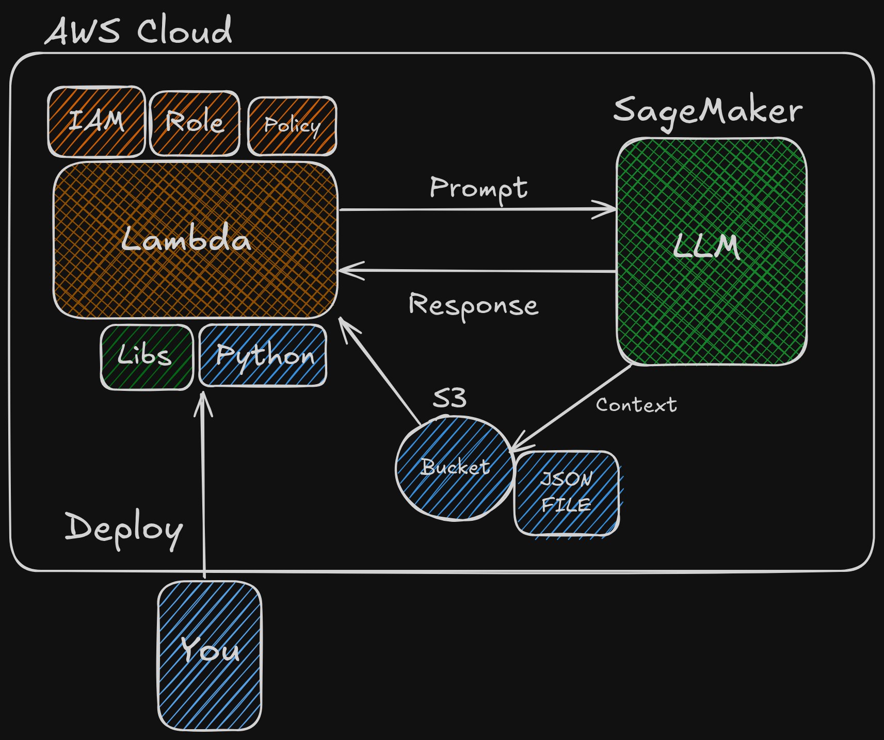

# 🚀 LambdaLLMOps Pipeline

> **A fully serverless, cloud-native pipeline that enables you to enrich prompts with contextual data stored in S3 and send them to an LLM (Large Language Model) for inference.**
>
> Built using AWS Lambda, IAM, S3, and pluggable LLM providers such as SageMaker, Together.ai, Gemini, or Mistral.

---

## 👨‍💻 Author

**Created with ❤️ by [Om Sharma](https://github.com/i-OmSharma)**

---

## 🚀 Overview

**LambdaLLMOps Pipeline** is a production-ready, serverless framework designed to integrate dynamic context retrieval from AWS S3 with cloud-hosted LLMs. The project enables developers to securely orchestrate prompt generation and inference using modern AI APIs or AWS-native models. It is highly extensible and supports cost-effective migration from SageMaker to third-party LLM providers.

## 🏗️ Architecture



---

## ✨ Key Features

- **Serverless & Scalable**: Built on AWS Lambda for automatic scaling and zero server management.
- **Contextual LLM Prompts**: Dynamically fetches JSON-based context from S3 to augment prompts.
- **Pluggable LLM Backend**: Easily switch from SageMaker to Together.ai, Gemini, Hugging Face, or Mistral by editing a single handler.
- **Security Best Practices**: Implements least-privilege IAM roles, environment variable-based secrets, and CloudWatch observability.
- **Infrastructure as Code**: Deployed using AWS SAM/CloudFormation for repeatable, version-controlled provisioning.
- **Developer-Friendly**: Modular structure with example context, test files, and deployment script.

---

## 📁 Project Structure

```
LambdaLLMOps-Pipeline/
├── README.md
├── template.yaml                 # Infrastructure-as-code (AWS SAM)
├── .gitignore
│
├── src/
│   └── lambda_function/
│       ├── app.py                # Main Lambda handler
│       ├── requirements.txt      # Python dependencies
│       └── __init__.py
│
├── context/
│   └── sample-context.json       # Sample JSON for prompt enrichment
│
├── tests/
│   └── test_app.py               # Unit tests for Lambda logic
│
├── scripts/
│   └── deploy.sh                 # Optional deployment script
│
└── .aws-sam/                     # SAM build artifacts (auto-generated)
```

---

## 💡 How It Works

1. A request is triggered (via API Gateway or manually) to Lambda.
2. Lambda reads the context file (JSON) from the specified S3 bucket.
3. Combines base prompt with context data to form a complete prompt.
4. Sends the prompt to an LLM endpoint (SageMaker or any API provider).
5. Returns the inference response to the caller.
6. Logs all operations and errors in CloudWatch.

---

## 🏗️ Prerequisites

- AWS Account (with required IAM permissions)
- AWS CLI (configured using `aws configure`)
- AWS SAM CLI
- Python 3.11+

---

## ⚙️ Quick Start

### 1. Clone the Repository

```bash
git clone https://github.com/i-OmSharma/LambdaLLMOps-Pipeline.git
cd LambdaLLMOps-Pipeline
```

### 2. Build & Deploy with AWS SAM

```bash
sam build
sam deploy --guided
```

- Answer prompts to configure stack, region, and IAM roles.
- This creates:

  - Lambda function
  - IAM role with minimal permissions
  - S3 bucket for context files

### 3. Upload a Context File to S3

```bash
aws s3 cp context/sample-context.json s3://<your-bucket-name>/sample-context.json
```

### 4. Set Environment Variables

Update `LLM_ENDPOINT`, `API_KEY`, and other variables for your chosen LLM provider (e.g., Together.ai, Gemini, etc.).

### 5. Invoke the Lambda Function

```bash
aws lambda invoke \
  --function-name <LambdaFunctionName> \
  --payload '{"prompt": "Summarize this context.", "context_file": "sample-context.json"}' output.json
```

---

## 🔁 Switching LLM Providers

You can easily replace SageMaker with any LLM provider:

- Edit `src/lambda_function/app.py`

  - Replace SageMaker invoke code with a POST request to your LLM API (Together.ai, Gemini, Mistral, etc.).

- Update environment variables: `LLM_ENDPOINT`, `API_KEY`, `MODEL_NAME`, etc.
- No need to redeploy infrastructure—just modify code and redeploy Lambda.

---

## 🔐 Security & Observability

- **IAM Roles**: Lambda granted only `s3:GetObject`, `logs:*`, and (optionally) `sagemaker:InvokeEndpoint`.
- **Secrets Management**: API keys and sensitive config stored as environment variables.
- **CloudWatch**: Logs for all actions and exceptions for debugging and monitoring.

---

## 📎 Example Files

- `src/lambda_function/app.py` — main Python handler (modular, editable)
- `context/sample-context.json` — demo context file
- `template.yaml` — annotated CloudFormation template
- `tests/test_app.py` — basic unit test sample

---

## 🛠️ Development & Customization

- Add logic to `app.py` for advanced prompt engineering or multi-LLM routing.
- Extend `template.yaml` for VPC access, layers, or API Gateway triggers.
- Add `.env` support for local development/testing.
- Use `scripts/deploy.sh` to automate CI/CD deployment.

---

## 🤝 Contributing

Pull requests and issue reports are welcome!

---

## 📄 License

Licensed under the [MIT License](LICENSE).

---

## 💬 Support

For help or questions, feel free to open an issue. For enterprise-grade deployments or LLM tuning, please consult the official documentation of your chosen LLM provider and AWS best practices.

---

<div align="center">

> **Build AI pipelines that scale securely and cost-efficiently—on your cloud terms.**

**⭐ Star this repo if you found it helpful!**

</div>
